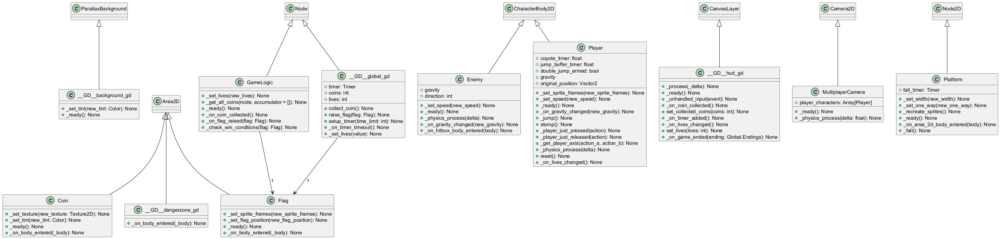

# Godot2pUML — Generate UML Class Diagrams from Godot Projects

**Godot2pUML** is a quick-and-dirty parser for Godot projects (written in strongly typed GDScript) that generates UML class diagrams in the [PlantUML](https://plantuml.com/) format (`.puml`).

This tool was developed as a personal project to help visualize the structure of Godot codebases. It's a lightweight, experimental utility — not thoroughly tested, and not intended for production use. Use at your own discretion.

Again, this is not intendent for production use. I personally only use it to get an overview of my current projects.

---

## Example

The merged output when running Godot2pUML against a demo project: [Moddable Platformer](https://godotengine.org/asset-library/asset/3371)




## What It Does

Godot2pUML parses your `.gd` files and extracts:
- **Class names**
- **Inheritance**
- **Signals**
- **Methods**
- **Properties**

| UML Concept         | Supported? | Notes                                           |
|---------------------|------------|-------------------------------------------------|
| Inheritance         | ✅ Yes     | Detected via `extends`                          |
| Interfaces          | ❌ No      | Godot does not support interfaces               |
| Composition         | ❌ No      |                                                 |
| Aggregation         | ❌ No      |                                                 |
| Association         | ❌ No      | PlantUML doesn't have a symbol for associations |
| Dependency          | ✅ Yes     | All associations are treated as dependencies    |
| Weak Dependency     | ❌ No      |                                                 |

---

## Usage

**On Windows:**

```bash
python main.py godot_project_directory output_directory
```

This will:
- Parse all `.gd` files in the given Godot project directory
- Generate `.puml` files in the given output directory
- Merge them into a single UML diagram

---

## Known Issues

- **Large Diagrams:** If the diagram is too large to render properly, refer to the [PlantUML FAQ](https://plantuml.com/faq#e689668a91b8d065) for tips on handling large class diagrams.

---

##  Thoughts & Future Ideas

- With `@export` annotations, it may be possible to infer **aggregations**.
- Instead of a parser, directly query the Objects... ? But this isn't the approach I chose.

---

## License

This project is licensed under the **MIT License**.
